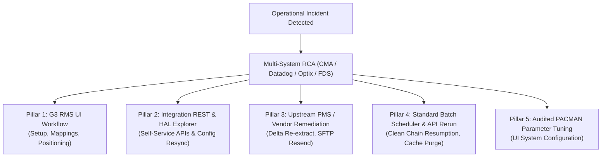
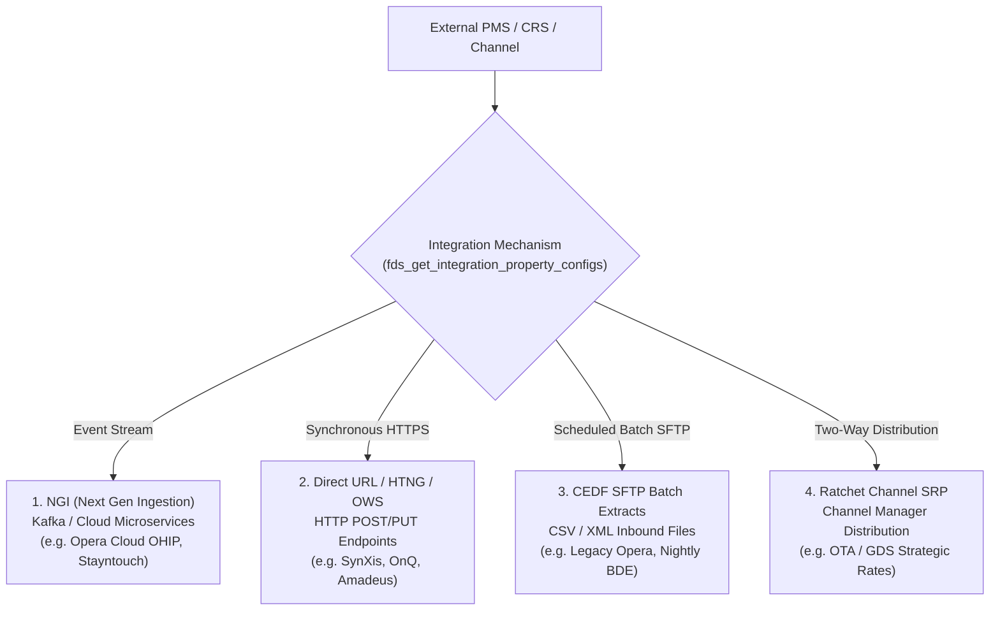

# SAS IDeaS Zero-Database-Change (Zero-DB) Remediation Playbook

## 1. The Zero-DB Philosophy & Compliance Mandate

In SAS IDeaS production environments (G3 RMS, Optix Data Warehouse, CMA, UPS/FDS), **direct database modifications (`UPDATE`, `DELETE`, `INSERT`, `ALTER`, `DROP`) are strictly prohibited**.

### Why Direct Database Edits Fail:
1. **SOX & SOC2 Compliance Violations**: Direct SQL updates bypass enterprise audit trails and ticket authorization workflows.
2. **In-Memory Cache Invalidation Bypassed**: Microservices, Redis, Hazelcast, and G3 optimization engines cache state in memory. Manual DB changes lead to cache desynchronization, ghost decisions, and erratic pricing behavior.
3. **Event Stream Disruption**: Changes must trigger Spring Batch lifecycle events, Kafka/RabbitMQ messages, and HAL REST webhook notifications. Direct DB edits do not publish these events.
4. **Recurrence on Next Ingestion**: If an unmapped code or corrupted record is manually updated in the database without fixing the UI mapping or upstream PMS export, the next nightly BDE feed overwrites or fails again.
5. **Operational Accessibility**: Field support engineers, revenue managers, and client IT administrators do not have production DB write access. Solutions must be executable using standard tools and interfaces.

---

## 2. The 5 Zero-DB Remediation Pillars

Every operational incident investigated by the Copilot must resolve into one of the following five non-database channels:



---

## 3. Symptom-to-Non-DB-Solution Matrix

### Scenario 1: Unmapped Room Types, Rate Codes, or Market Segments
- **Symptoms**: Batch job fails with `ERR_UNMAPPED_DIMENSION` or transactions accumulate in unassigned buckets.
- **Root Cause**: Upstream PMS introduced a new code (`DLXK`, `CORP_PROMO`, `GRP_WEDDING`) not yet registered in G3 RMS.
- **Zero-DB Solution**:
  1. **Room Types**:
     - In G3 RMS UI, navigate to **Settings > Property Setup > Room Configuration > Room Types**.
     - Open the **Unmapped Room Types** tab.
     - Locate the new code (e.g., `DLXK`), assign it to an existing Pseudo Room Class or define it as a new Physical Type, enter capacity, and click **Save & Apply**.
  2. **Rate Codes / SRP**:
     - Navigate to **Pricing & Restrictions > Rate Management > Rate Codes**.
     - Under **Unmapped Rates**, link the code to the designated **Strategic Rate Plan (SRP)** group.
     - Toggle rate parity and rate ceiling/floor rules, then click **Publish Mappings**.
  3. **Reprocess Feed**:
     - Navigate to **System > Sync Status > Resync Reservations** (or wait for the next scheduled hourly delta feed to digest the newly mapped transactions automatically).

---

### Scenario 2: Batch Chain Blocked, Stale Job State, or Deadlock
- **Symptoms**: Nightly optimization chain hangs in `STARTED` or `BLOCKED` status; `Job_Execution` shows lock on `Accom_Activity`.
- **Root Cause**: Worker node timeout during heavy pickup, or contention between BDE ingest and pricing export jobs.
- **Zero-DB Solution**:
  1. **Do NOT run SQL** (`UPDATE Job_Execution SET Status = 'FAILED'`).
  2. In CMA Edge Gateway portal (**CMA > Batch Orchestration > Chains**):
     - Filter for the tenant property chain (e.g., `IDeaS_Batch_Hilton_LONLK`).
     - Inspect the failing step. Click **Action > Safe Resume / Restart Step**.
     - The Spring Batch runtime automatically clears orphaned transaction locks, executes rollback cleanups, and advances execution state.
  3. If waiting on external files:
     - Verify file arrival using `cma_get_datafeed_status`. Once the upstream file lands, click **Resume Chain**.

---

### Scenario 3: Decision Delivery Failures / Rates Not Uploading to PMS
- **Symptoms**: Rates calculated in G3 RMS do not reflect in the client's Opera/OnQ PMS; delivery logs show HTTP 500 or timeout.
- **Root Cause**: PMS listener downtime, expired HTNG credentials, or blocked delivery worker queue.
- **Zero-DB Solution**:
  1. **Check Delivery Pipeline**: Inspect recent delivery attempts using `cma_get_decision_delivery_details` and `datadog_trace_decision_delivery_errors`.
  2. **Verify Credentials in HAL**:
     - Open HAL Explorer (`https://integration-setting-internal.ideasrms.com/`).
     - Query `integrationPropertyConfigs` for the property. Verify endpoint URL, HTNG user/pass, and vendor code.
  3. **Trigger Immediate Delivery Cycle in G3 RMS**:
     - In G3 RMS UI, navigate to **Pricing > Decision Delivery > Delivery Status**.
     - Review the failed upload batch. Click **Force Redelivery**.
  4. **PMS Vendor Action**:
     - If the PMS listener is rejecting connections (`ERR_PMS_TIMEOUT` or `Connection Refused`), provide the client with the partner error message and request that their hotel IT/PMS vendor restart the HTNG interface listener.

---

### Scenario 4: Missing Inbound PMS Feed / Stale Transaction Data
- **Symptoms**: BDE data import freshness shows data is >24 hours old (`cma_get_datafeed_import_freshness`).
- **Root Cause**: Hotel PMS scheduled nightly export failed to transmit to CEDF SFTP, or file had invalid headers.
- **Zero-DB Solution**:
  1. **Do NOT manually insert reservation rows into SQL tables.**
  2. **Vendor Re-Extraction**:
     - Request the hotel IT or Night Auditor to run a manual historical/delta export from their PMS (e.g., Opera PMS: *PMS > Miscellaneous > File Export > IDeaS Data Extract*) for the missing date window.
     - Transmit the file to the property's dedicated CEDF SFTP directory `/inbound/`.
  3. **Trigger File Ingestion**:
     - In G3 RMS UI, navigate to **System Operations > Data Feeds > Ingest Queue**.
     - Select the uploaded file and click **Process Now**.

---

### Scenario 5: Pricing Frozen / Competitive Market Position Constraint Conflicts
- **Symptoms**: Recommended rates remain flat or hit inexplicable ceilings/floors.
- **Root Cause**: Competitive position rules conflict with LRV floor or create price inversions between room classes.
- **Zero-DB Solution**:
  1. **Identify the Conflict**:
     - Check `Competitive_Constraint` and `LRV` using diagnostic tools.
  2. **Adjust Constraint in G3 UI**:
     - In G3 RMS UI, navigate to **Pricing > Competitive Intelligence > Positioning Rules**.
     - Locate the conflicting rule (e.g., "Must remain 5% below Competitor B" when Competitor B closed all standard rooms).
     - Check the box **"Exclude Competitor When Rates Are Closed"** or relax the floor constraint to respect the Last Room Value (LRV).
     - Click **Save & Recalculate**.

---

### Scenario 6: Microservice Configuration Desynchronization
- **Symptoms**: FDS/UPS service rejecting API requests or returning outdated configuration for a property.
- **Root Cause**: Distributed cache out of sync with central configuration database.
- **Zero-DB Solution**:
  1. Use Spring Data REST HAL Explorer (`https://integration-setting-internal.ideasrms.com/`):
     - Check `fds_get_integration_property_configs` for active parameters.
     - Send a standard `PATCH` request to the property config resource with updated fields.
  2. Trigger clean cache refresh:
     - Invoke `fds_probe_microservice_health` or standard actuator endpoint `POST /actuator/refresh` to evict stale cache entries across worker nodes without taking down services.

---

### Scenario 7: PACMAN Parameter Tuning
- **Symptoms**: Client requests tuning for demand unconstraining sensitivity or continuous pricing behavior.
- **Root Cause**: Configuration adjustment needed.
- **Zero-DB Solution**:
  1. Review existing configuration and past changes using `cma_get_parameter_audit_history`.
  2. In G3 RMS UI:
     - Navigate to **Admin > System Configuration > PACMAN Parameters**.
     - Search for the parameter key (e.g., `pacman.pricing.continuous.sensitivity`).
     - Enter the new value, provide the mandatory **Change Reason** (linking the Salesforce Case #), and click **Apply**.
  3. This ensures automatic worker notification, hot-reloading into RAM, and full regulatory audit compliance.

---

## 4. External System Transport & Delivery Topology

Inbound extracts and outbound deliveries at SAS IDeaS are **heterogeneous** across external systems and property management partners. The Copilot must first identify the transport mechanism before diagnosing:



### Mechanism 1: NGI (Next Generation Integration / Ingestion)
- **Architecture**: Real-time event streaming powered by Kafka event buses and cloud-native ingestion microservices.
- **Common Systems**: Oracle Hospitality Integration Platform (OHIP), Opera Cloud, modern cloud PMS (Mews, Stayntouch).
- **Failure Modes**: Kafka consumer lag, message deserialization failure, schema registry incompatibility, dead-letter queue (DLQ) overflow, token expiration.
- **Diagnostic Tools**:
  * `datadog_trace_pms_inbound_stream` (traces consumer lag & streaming errors)
  * `fds_probe_microservice_health` (probes ingestion service latency & availability)
  * `fds_get_nucleus_integration_settings` (checks event bus configuration)
- **Zero-DB Resolution**:
  * In G3 RMS UI: Trigger **System > Sync Status > Replay Streaming Messages from Timestamp**.
  * If partner webhook stopped firing, instruct hotel IT / PMS vendor to verify the OHIP outbound webhook subscription status.
  * In HAL Explorer: Issue cache refresh via `POST /actuator/refresh` on the NGI consumer service.

---

### Mechanism 2: Direct URL / HTNG / OWS Outbound Delivery
- **Architecture**: Synchronous or asynchronous HTTPS POST/PUT requests delivering pricing recommendations directly to the external partner endpoint.
- **Common Systems**: Sabre SynXis CRS, Amadeus iHotelier, Hilton OnQ, Opera On-Premise via OXI / OWS proxy.
- **Failure Modes**: HTTP 401/403 (expired TLS cert or invalid basic auth), HTTP 404 (endpoint path altered), HTTP 500/504 (PMS listener timed out >30s or crashed), HTNG XML schema validation rejection.
- **Diagnostic Tools**:
  * `cma_get_decision_delivery_details` (checks upload status, error codes, and batch IDs)
  * `datadog_trace_decision_delivery_errors` (traces outbound HTTP 5xx and timeout traces)
  * `fds_get_integration_property_configs` (validates endpoint URL and authentication method)
- **Zero-DB Resolution**:
  * In G3 RMS UI: Go to **Pricing > Decision Delivery > Delivery Status > Force Redelivery**.
  * If credentials mismatch: Update in HAL Explorer (`https://integration-setting-internal.ideasrms.com/`) via `PATCH /integrationPropertyConfigs/{id}`.
  * If PMS endpoint timed out: Provide the exact HTTP error code to the hotel IT team and request they restart their local HTNG interface listener.

---

### Mechanism 3: File-Based CEDF / SFTP Batch Inbound & Outbound
- **Architecture**: Scheduled file-based batch extracts (flat CSV, pipe-delimited, or XML files) pushed or pulled via secure SFTP servers (`cedf.ideasrms.com`), ingested into Optix via Spring Batch BDE.
- **Common Systems**: Legacy Opera PMS (PMS extracts), custom enterprise data feeds, nightly audit dumps.
- **Failure Modes**: SFTP connection drop, 0-byte file locks, corrupt file headers, missing date ranges, file landing after batch cutoff time.
- **Diagnostic Tools**:
  * `cma_get_datafeed_status` (checks recent file landing status and sizes)
  * `cma_get_datafeed_import_freshness` (checks timestamp of last successfully ingested reservation record)
  * `cedf_get_clients_configuration` and `cedf_check_client_upload_status` (verifies CEDF client upload enablement)
  * `cma_get_batch_job_history` (checks BDE import step status)
- **Zero-DB Resolution**:
  * Do NOT manually insert rows into database tables.
  * Have hotel Night Auditor / IT trigger a manual delta or historical extract from PMS (e.g. Opera: *Miscellaneous > File Export > IDeaS Extract*) directly to the CEDF SFTP `/inbound/` directory.
  * In G3 RMS UI: Go to **System Operations > Data Feeds > Ingest Queue > Process Now**.

---

### Mechanism 4: Ratchet SRP Channel Distribution
- **Architecture**: Ratchet middleware synchronizing Strategic Rate Plans (SRPs) across channel managers, OTAs, and CRS partners.
- **Diagnostic Tools**:
  * `cma_get_ratchet_srp_mappings` (checks active channel mappings, SRP groups, and attributes)
- **Zero-DB Resolution**:
  * Link unmapped SRPs in G3 RMS **Pricing & Restrictions > Rate Management > SRP Mapping**.
  * Publish rate plan changes to trigger Ratchet cache reload.

---

## 5. Comparative "Apples-to-Apples" Twin Analysis Rule

When performing comparative analysis against a sister or twin property:
1. **Always match the Integration Mechanism**:
   - Compare an **NGI property** against another **NGI property**.
   - Compare a **Direct URL / HTNG property** against another **Direct URL property**.
   - Compare a **CEDF SFTP property** against another **CEDF SFTP property**.
2. **Never cross mechanisms**: Comparing an NGI property to an SFTP property creates false positives because their pipeline architectures, latency tolerances, and failure modes are fundamentally different.

---

## 6. Standard Copilot Response Architecture

Whenever an operational issue is triaged, the Copilot must structure its response using this 4-part anatomy:

```markdown
### 1. 🔍 Investigation & Diagnostic Findings
- **Integration Mechanism**: [Identified: NGI Stream | Direct URL/HTNG | CEDF SFTP | Ratchet SRP]
- **Observed Symptoms & Error Codes**: [Specific error codes, e.g. ERR_UNMAPPED_DIMENSION, HTTP 504, Kafka lag]
- **Connected Pipeline Telemetry**: [CMA batch logs, Datadog traces, SFTP/Stream arrival timestamps]
- **Comparative Twin Analysis (Apples-to-Apples)**:
  * Target Property: [e.g. LONLK - Failing (Direct URL / HTNG)]
  * Baseline Twin Property: [e.g. LONHA - Healthy (Direct URL / HTNG)]
  * Discrepancies Isolated: [e.g. LONLK endpoint timeout set to 15s instead of 60s]
- **Temporal Audit Delta**: [Recent parameter changes or config edits from audit history]

### 2. 🎯 Root Cause Analysis (RCA)
- [Clear technical explanation isolating the exact subsystem and transport failure]

### 3. 🛠️ Zero-DB Remediation Plan
- **Step 1 (Application UI Workflow)**: [Exact G3 RMS or Ratchet UI click path: Settings > ... > Save]
- **Step 2 (Service / Orchestration Action)**: [CMA Portal step restart or HAL Explorer self-service API call]
- **Step 3 (Client / Vendor Action)**: [Specific instructions for hotel IT or PMS vendor if upstream action needed]

### 4. 🛡️ Verification & Prevention
- **Verification Check**: [Which tool, screen, or endpoint confirms resolution]
- **Recurrence Prevention**: [Configuration or SOP change to prevent repeating]
```

